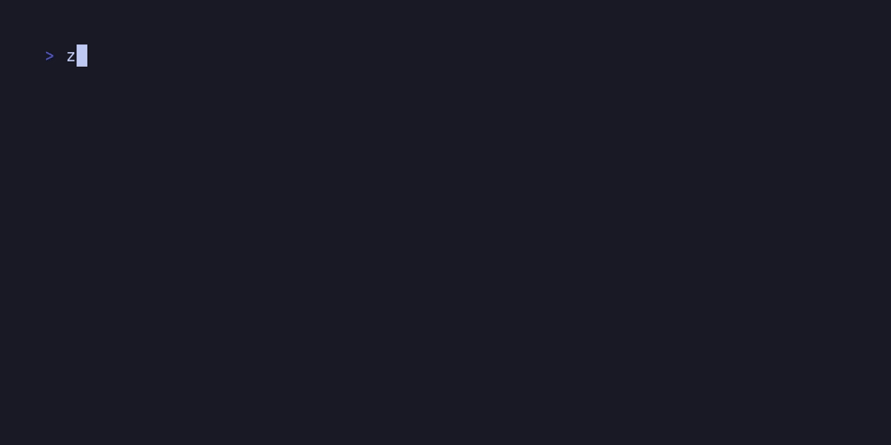

# libvaxis

```
It begins with them, but ends with me. Their son, Vaxis
```



Libvaxis _does not use terminfo_. Support for vt features is detected through
terminal queries.

Contributions are welcome.

Vaxis uses zig `0.13.0`.

## Features

libvaxis supports all major platforms: macOS, Windows, Linux/BSD/and other
Unix-likes.

| Feature                        |  libvaxis  |
| ------------------------------ |  :------:  |
| RGB                            |     ✅     |
| Hyperlinks                     |     ✅     |
| Bracketed Paste                |     ✅     |
| Kitty Keyboard                 |     ✅     |
| Styled Underlines              |     ✅     |
| Mouse Shapes (OSC 22)          |     ✅     |
| System Clipboard (OSC 52)      |     ✅     |
| System Notifications (OSC 9)   |     ✅     |
| System Notifications (OSC 777) |     ✅     |
| Synchronized Output (DEC 2026) |     ✅     |
| Unicode Core (DEC 2027)        |     ✅     |
| Color Mode Updates (DEC 2031)  |     ✅     |
| [In-Band Resize Reports](https://gist.github.com/rockorager/e695fb2924d36b2bcf1fff4a3704bd83)   |     ✅     |
| Images (kitty)                 |     ✅     |

## Usage

[Documentation](https://rockorager.github.io/libvaxis/#vaxis.Vaxis)

[Starter repo](https://github.com/rockorager/libvaxis-starter)

Vaxis requires three basic primitives to operate:

1. A TTY instance
2. An instance of Vaxis
3. An event loop

The library provides a general purpose posix TTY implementation, as well as a
multi-threaded event loop implementation. Users of the library are encouraged to
use the event loop of their choice. The event loop is responsible for reading
the TTY, passing the read bytes to the vaxis parser, and handling events.

A core feature of Vaxis is it's ability to detect features via terminal queries
instead of relying on a terminfo database. This requires that the event loop
also handle these query responses and update the Vaxis.caps struct accordingly.
See the `Loop` implementation to see how this is done if writing your own event
loop.

## Example

```zig
const std = @import("std");
const vaxis = @import("vaxis");
const Cell = vaxis.Cell;
const TextInput = vaxis.widgets.TextInput;
const border = vaxis.widgets.border;

// This can contain internal events as well as Vaxis events.
// Internal events can be posted into the same queue as vaxis events to allow
// for a single event loop with exhaustive switching. Booya
const Event = union(enum) {
    key_press: vaxis.Key,
    winsize: vaxis.Winsize,
    focus_in,
    foo: u8,
};

pub fn main() !void {
    var gpa = std.heap.GeneralPurposeAllocator(.{}){};
    defer {
        const deinit_status = gpa.deinit();
        //fail test; can't try in defer as defer is executed after we return
        if (deinit_status == .leak) {
            std.log.err("memory leak", .{});
        }
    }
    const alloc = gpa.allocator();

    // Initialize a tty
    var tty = try vaxis.Tty.init();
    defer tty.deinit();

    // Initialize Vaxis
    var vx = try vaxis.init(alloc, .{});
    // deinit takes an optional allocator. If your program is exiting, you can
    // choose to pass a null allocator to save some exit time.
    defer vx.deinit(alloc, tty.anyWriter());


    // The event loop requires an intrusive init. We create an instance with
    // stable pointers to Vaxis and our TTY, then init the instance. Doing so
    // installs a signal handler for SIGWINCH on posix TTYs
    //
    // This event loop is thread safe. It reads the tty in a separate thread
    var loop: vaxis.Loop(Event) = .{
      .tty = &tty,
      .vaxis = &vx,
    };
    try loop.init();

    // Start the read loop. This puts the terminal in raw mode and begins
    // reading user input
    try loop.start();
    defer loop.stop();

    // Optionally enter the alternate screen
    try vx.enterAltScreen(tty.anyWriter());

    // We'll adjust the color index every keypress for the border
    var color_idx: u8 = 0;

    // init our text input widget. The text input widget needs an allocator to
    // store the contents of the input
    var text_input = TextInput.init(alloc, &vx.unicode);
    defer text_input.deinit();

    // Sends queries to terminal to detect certain features. This should always
    // be called after entering the alt screen, if you are using the alt screen
    try vx.queryTerminal(tty.anyWriter(), 1 * std.time.ns_per_s);

    while (true) {
        // nextEvent blocks until an event is in the queue
        const event = loop.nextEvent();
        // exhaustive switching ftw. Vaxis will send events if your Event enum
        // has the fields for those events (ie "key_press", "winsize")
        switch (event) {
            .key_press => |key| {
                color_idx = switch (color_idx) {
                    255 => 0,
                    else => color_idx + 1,
                };
                if (key.matches('c', .{ .ctrl = true })) {
                    break;
                } else if (key.matches('l', .{ .ctrl = true })) {
                    vx.queueRefresh();
                } else {
                    try text_input.update(.{ .key_press = key });
                }
            },

            // winsize events are sent to the application to ensure that all
            // resizes occur in the main thread. This lets us avoid expensive
            // locks on the screen. All applications must handle this event
            // unless they aren't using a screen (IE only detecting features)
            //
            // The allocations are because we keep a copy of each cell to
            // optimize renders. When resize is called, we allocated two slices:
            // one for the screen, and one for our buffered screen. Each cell in
            // the buffered screen contains an ArrayList(u8) to be able to store
            // the grapheme for that cell. Each cell is initialized with a size
            // of 1, which is sufficient for all of ASCII. Anything requiring
            // more than one byte will incur an allocation on the first render
            // after it is drawn. Thereafter, it will not allocate unless the
            // screen is resized
            .winsize => |ws| try vx.resize(alloc, tty.anyWriter(), ws),
            else => {},
        }

        // vx.window() returns the root window. This window is the size of the
        // terminal and can spawn child windows as logical areas. Child windows
        // cannot draw outside of their bounds
        const win = vx.window();

        // Clear the entire space because we are drawing in immediate mode.
        // vaxis double buffers the screen. This new frame will be compared to
        // the old and only updated cells will be drawn
        win.clear();

        // Create a style
        const style: vaxis.Style = .{
            .fg = .{ .index = color_idx },
        };

        // Create a bordered child window
        const child = win.child(.{
            .x_off = win.width / 2 - 20,
            .y_off = win.height / 2 - 3,
            .width = .{ .limit = 40 },
            .height = .{ .limit = 3 },
            .border = .{
                .where = .all,
                .style = style,
            },
        });

        // Draw the text_input in the child window
        text_input.draw(child);

        // Render the screen. Using a buffered writer will offer much better
	// performance, but is not required
        try vx.render(tty.anyWriter());
    }
}
```

## Contributing

Contributions are welcome. Please submit a PR on Github or a patch on the
[mailing list](mailto:~rockorager/libvaxis@lists.sr.ht) 
